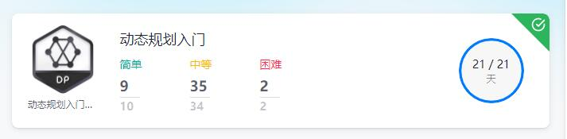
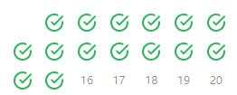
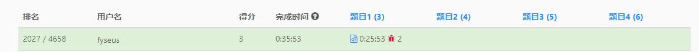
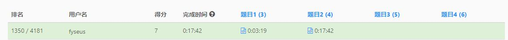
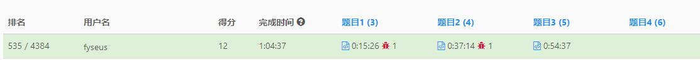
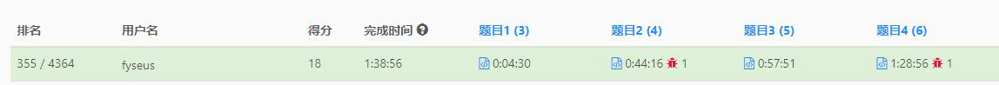
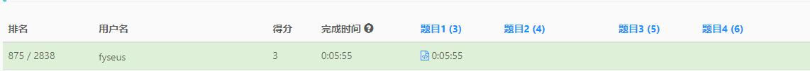
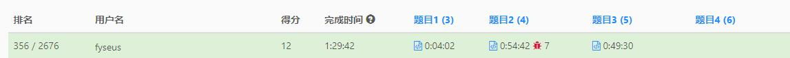

# leetcode❤❤
my story with leetcode
主要记录做题中的一些收获，以及做题的记录，以及自己收集的一些资料：

- Top100热题
- 动态规划
- 每日一题
- 周赛与双周赛
- 算法的收集
- 教训与整理
- 🗡指offer

## Top100热题

已经刷完了（其中有一道会员的plus题做不了），文件夹中保存了普通与困难的代码

## 动态规划

记录了21天的动态规划刷题记录，每天平均2-3题，算是差不多入门了

## 每日一题

记录了每日一题中困难与普通的题目

## 周赛与双周赛

头两场有点惨烈（刚开始刷，而且从C++换到JAVA也有点不适应），后面稳定在3题左右，偶尔能做出4题（此时基本上是刷完TOP100）之后了；
放置了做题的记录（64场双周赛还有个困难题没有整理）

### 第264场单周赛

### 第265场单周赛

### 第266场单周赛

### 第267场单周赛

### 第64场双周赛

### 第65场双周赛

## 算法

刷题时遇到的一些算法笔记

## 教训与整理

包括HashMap等等各类模板类的使用，同时还有自定义的并查集等等

## 🗡指offer

新开的🕳，目前还没做很多题
